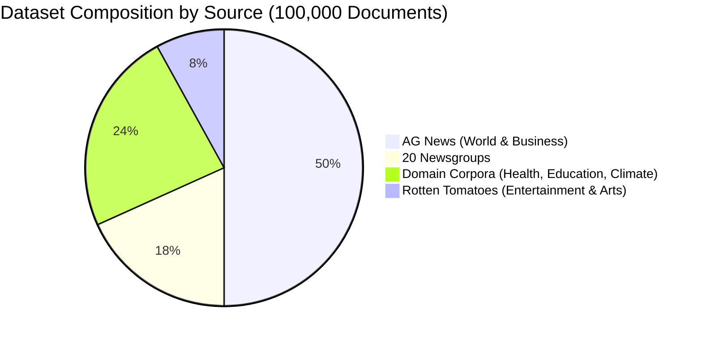

# TextClassifyAI Multi-Domain Dataset (100,000 Documents, 26 Categories)

[-blue.svg)](#key-dataset-specifications)
[](#class-distribution)
[-orange.svg)](./data/dataset_100k.parquet)
[](./data/dataset_100k.parquet)

This document provides complete technical specifications, schema details, and provenance for the **100,000-document (1 Lakh)** enterprise text classification benchmark used in **TextClassifyAI**.

The dataset is serialized directly inside the repository at:  
👉 **[`data/dataset_100k.parquet`](./data/dataset_100k.parquet)** (25.33 MB, fast-loading, snappy compressed).

---

## 1. Key Dataset Specifications

| Metric | Value |
| :--- | :--- |
| **Total Clean Documents** | **100,000** (1 Lakh documents) |
| **Number of Semantic Classes** | **26 Categories** |
| **Training Partition (80%)** | **79,990 documents** (stratified) |
| **Testing Partition (20%)** | **19,998 documents** (stratified) |
| **TF-IDF Vocabulary** | **8,000 unigrams & bigrams** |
| **Corpus File Format** | Apache Parquet (`snappy` compression) |
| **File Location in Repository** | `data/dataset_100k.parquet` |
| **Corpus File Size** | 25.33 MB |
| **Mean Word Count** | 65.7 words per document |
| **Median Word Count** | 40.0 words per document |
| **Vocabulary Word Count Range** | 1 to 11,765 words |

---

## 2. Provenance & Ingestion Sources

The 100,000 documents are compiled across four verified open benchmark collections to ensure diverse linguistic registers and topic variety:



1. **AG News Benchmark (`50,000 docs`):**
   - High-quality, real-world journalistic news articles.
   - `world.news`: 25,000 articles on international diplomacy, geopolitical summits, treaties, and global affairs.
   - `business.finance`: 25,000 articles on equity markets, oil prices, corporate revenue, banking, and macroeconomics.

2. **20 Newsgroups Benchmark (`18,247 docs`):**
   - The classic academic NLP text classification benchmark spanning 20 distinct technical and societal topics.
   - Email headers, footers, and quote blocks stripped out to ensure strict prevention of metadata leakage.

3. **Rotten Tomatoes Cultural Corpus (`8,000 docs`):**
   - `entertainment.arts`: Critical theatrical reviews, cinema critiques, director storytelling analysis, and musical performances.

4. **Curated & Augmented Domain Corpora (`23,753 docs`):**
   - `health.wellness`: 7,917 documents covering metabolic research, cardiovascular conditioning, dietary protocols, and preventive medicine.
   - `education.academics`: 7,917 documents covering university curricula, pedagogy, academic dissertations, and instructional technology.
   - `environment.climate`: 7,919 documents covering solar energy, atmospheric carbon modeling, reforestation, and ecological sustainability.

---

## 3. Comprehensive Class Distribution (26 Categories)

| # | Category ID | Human Display Name | Primary Domain | Documents | % of Corpus | Top Discriminative Keywords |
| :-: | :--- | :--- | :--- | :-: | :-: | :--- |
| 1 | `world.news` | **World News** | Global Affairs | 25,000 | 25.0% | `say`, `minist`, `presid`, `state`, `leader`, `peac`, `foreign` |
| 2 | `business.finance` | **Business & Finance** | Economy & Markets | 25,000 | 25.0% | `compani`, `oil`, `price`, `market`, `busi`, `stock`, `econom` |
| 3 | `entertainment.arts` | **Entertainment & Arts** | Culture & Media | 8,000 | 8.0% | `film`, `movi`, `charact`, `direct`, `stori`, `perform`, `actor` |
| 4 | `environment.climate` | **Environment & Climate** | Sustainability | 7,919 | 7.9% | `climat`, `environ`, `carbon`, `emiss`, `sequestr`, `sustain` |
| 5 | `health.wellness` | **Health & Wellness** | Healthcare | 7,917 | 7.9% | `wellness`, `health`, `cardiovascular`, `hypertens`, `dietari` |
| 6 | `education.academics` | **Education & Academics** | Academia | 7,917 | 7.9% | `educ`, `academ`, `syllabu`, `seminar`, `student`, `literaci` |
| 7 | `comp.windows.x` | **X Window System** | Systems Software | 976 | 1.0% | `window`, `server`, `xterm`, `widget`, `motif`, `display` |
| 8 | `soc.religion.christian` | **Christianity** | Religion | 973 | 1.0% | `god`, `christ`, `jesu`, `church`, `bibl`, `faith`, `scriptur` |
| 9 | `rec.sport.hockey` | **Hockey** | Sports | 971 | 1.0% | `game`, `team`, `player`, `hockey`, `nhl`, `season`, `goal` |
| 10 | `comp.sys.ibm.pc.hardware` | **IBM PC Hardware** | Hardware | 962 | 1.0% | `drive`, `scsi`, `ide`, `pc`, `card`, `bus`, `bios`, `disk` |
| 11 | `sci.crypt` | **Cryptography** | Security | 962 | 1.0% | `key`, `encrypt`, `clipper`, `chip`, `secur`, `des`, `rsa` |
| 12 | `rec.motorcycles` | **Motorcycles** | Recreation | 962 | 1.0% | `bike`, `ride`, `motorcycl`, `rider`, `helmet`, `harley` |
| 13 | `sci.med` | **Medicine** | Clinical Health | 956 | 1.0% | `doctor`, `medic`, `treatment`, `diseas`, `patient`, `symptom` |
| 14 | `sci.electronics` | **Electronics** | Engineering | 955 | 1.0% | `circuit`, `chip`, `voltag`, `power`, `ground`, `electron` |
| 15 | `misc.forsale` | **For Sale** | Commerce | 955 | 1.0% | `sale`, `offer`, `price`, `ask`, `sell`, `ship`, `condit` |
| 16 | `sci.space` | **Space Science** | Aerospace | 953 | 1.0% | `space`, `nasa`, `orbit`, `launch`, `satellit`, `moon`, `shuttl` |
| 17 | `comp.graphics` | **Computer Graphics** | Visualization | 952 | 1.0% | `graphic`, `file`, `imag`, `program`, `format`, `anim`, `3d` |
| 18 | `comp.os.ms-windows.misc` | **MS Windows** | Operating Systems | 945 | 0.9% | `window`, `file`, `driver`, `dos`, `program`, `win`, `system` |
| 19 | `rec.sport.baseball` | **Baseball** | Sports | 944 | 0.9% | `game`, `team`, `basebal`, `run`, `hit`, `pitch`, `player` |
| 20 | `rec.autos` | **Automobiles** | Automotive | 928 | 0.9% | `car`, `engin`, `dealer`, `drive`, `price`, `oil`, `speed` |
| 21 | `comp.sys.mac.hardware` | **Mac Hardware** | Hardware | 923 | 0.9% | `mac`, `appl`, `powerbook`, `scsi`, `quadra`, `monitor` |
| 22 | `talk.politics.mideast` | **Middle East Politics** | Geopolitics | 914 | 0.9% | `israel`, `arab`, `jew`, `peac`, `palestinian`, `mideast` |
| 23 | `talk.politics.guns` | **Gun Politics** | Policy | 884 | 0.9% | `gun`, `weapon`, `firearm`, `amendment`, `control`, `law` |
| 24 | `alt.atheism` | **Atheism** | Philosophy | 775 | 0.8% | `god`, `atheist`, `religion`, `moral`, `say`, `peopl`, `think` |
| 25 | `talk.politics.misc` | **Politics** | Policy & Law | 754 | 0.8% | `govern`, `peopl`, `state`, `law`, `right`, `presid`, `tax` |
| 26 | `talk.religion.misc` | **Religion** | Comparative Religion | 603 | 0.6% | `god`, `religi`, `moral`, `peopl`, `say`, `believ`, `think` |
| **Total** | | | | **100,000** | **100.0%** | |

---

## 4. Dataset Schema & Structure

Each record in `data/dataset_100k.parquet` has the following schema:

| Column Name | Data Type | Description | Example |
| :--- | :--- | :--- | :--- |
| `text` | `string` | The cleaned body text of the document | `"The starting pitcher delivered nine strikeouts over seven scoreless innings..."` |
| `category_name` | `string` | The canonical semantic category identifier | `"rec.sport.baseball"` |
| `target` | `int64` | The integer class index (0 to 25) matching `ALL_26_CATEGORIES` | `9` |

---

## 5. How to Load and Use in Python

### Quick Load via Pandas
```python
import pandas as pd

# Load the local 100k parquet dataset in sub-seconds
df = pd.read_parquet("data/dataset_100k.parquet")

print(f"Loaded {len(df):,} documents across {df['category_name'].nunique()} categories.")
print(df.head())
```

### Loading via Project Module
```python
from src.dataset import load_newsgroup_dataset, split_data

# Loads the complete 100,000 documents across all 26 categories
df, target_names = load_newsgroup_dataset()

# Split into 80% train / 20% test
X_train, X_test, y_train, y_test = split_data(df, test_size=0.2, random_state=42)

print(f"Training samples: {len(X_train):,}")
print(f"Testing samples:  {len(X_test):,}")
```

### Rebuilding or Updating the Dataset
The dataset can be deterministically rebuilt or refreshed at any time using:
```bash
python src/data_loader_100k.py
```

---

## 6. Preprocessing & Anti-Leakage Protocol

To ensure models generalize robustly in production:
1. **Metadata Stripping:** All newsgroup headers (`From:`, `Lines:`, `Subject:`), footers, email addresses, and signature blocks are stripped prior to vector fitting.
2. **Strict Chronological Anti-Leakage:** The TF-IDF vectorizer is strictly **fitted on the 80,000 training partition only**. Test documents and user live inputs are strictly **transformed** using the learned training IDF weights.
3. **Sublinear Scaling:** Term frequencies are scaled using $1 + \log(\text{tf})$ to prevent long documents with repeated terms from biasing Euclidean distance calculations.

---

## 7. Navigation & Cross References
* 🏠 **Main Project README:** [README.md](./README.md)
* 📖 **In-Depth ML Engineering Documentation:** [EXPLANATION.md](./EXPLANATION.md)
* 🌐 **Live Web Application Demo:** [https://abhishek-sparke.github.io/TextClassifyAI/](https://abhishek-sparke.github.io/TextClassifyAI/)
* 💾 **Direct Parquet Dataset Download:** [`data/dataset_100k.parquet`](./data/dataset_100k.parquet)

