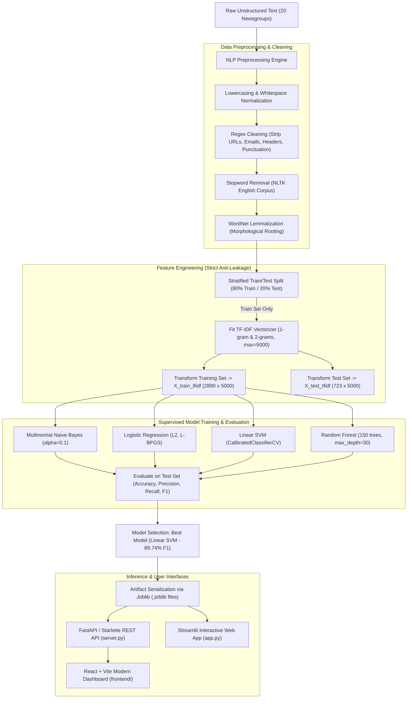

# Project Explanation & Technical Documentation

**Project Name:** Classifying Text Documents Using Machine Learning  
**Repository:** [Abhishek-Sparke/TextClassifyAI](https://github.com/Abhishek-Sparke/TextClassifyAI)  
**Domain:** Natural Language Processing (NLP) & Supervised Machine Learning  

---

## 1. Executive Summary

This project implements an end-to-end Natural Language Processing (NLP) and Machine Learning system designed to automatically classify unstructured text documents into distinct categories. It features a complete pipeline: data ingestion from the **20 Newsgroups** benchmark dataset, multi-stage text cleaning, stratified train-test splitting, **Term Frequency–Inverse Document Frequency (TF-IDF)** feature extraction, and competitive benchmarking across **four supervised machine learning classifiers**.

The system achieves an **89.74% accuracy and F1-score** using an optimal **Support Vector Machine (Linear SVM)** architecture with calibrated probability outputs, outperforming standard baselines. It is deployed as both a high-performance **REST API** (`server.py`), a modern **React dashboard** (`frontend/`), and an interactive **Streamlit web application** (`app.py`).

---

## 2. Real-World Problem & Motivation

Unstructured text accounts for over 80% of all enterprise digital data—including customer support tickets, email feeds, research publications, legal documents, and news feeds. Manual sorting is slow, costly, and error-prone. 

This project solves this challenge by answering three core engineering and research questions:
1. **Feature Representation:** How can textual tokens be mapped into dense or sparse numerical vectors that capture semantic importance while filtering noise?
2. **Model Selection:** Which algorithm achieves the best trade-off between training speed, inference latency, and classification accuracy when dealing with high-dimensional, sparse text matrices?
3. **Interpretability & Production Readiness:** How can we ensure model predictions are explainable (e.g., extracting key discriminative terms per class) and readily deployable via APIs and user interfaces?

---

## 3. End-to-End System Architecture

The following flowchart illustrates the complete lifecycle of a document from raw text to class prediction:



---

## 4. Dataset Overview

The project uses the standard **20 Newsgroups** text collection, partitioned across four distinct thematic classes:

| Class Key | Category Name | Description | Document Count |
| :--- | :--- | :--- | :--- |
| `comp.graphics` | **Computer Graphics** | Image processing, rendering, 3D file formats, algorithms | 953 |
| `rec.sport.baseball` | **Sports (Baseball)** | Game summaries, players, leagues, team scores, statistics | 951 |
| `sci.space` | **Space Science** | NASA missions, planetary astronomy, rocketry, satellites | 953 |
| `talk.politics.misc` | **Politics** | Government policies, political debate, elections, rights | 756 |
| **Total** | | **Balanced 4-Class Corpus** | **3,613** |

### Key Dataset Statistics:
* **Total Documents:** 3,613 documents
* **Mean Word Count:** 199.9 words per document (median: 82 words)
* **Metadata Stripping:** Email headers (`From:`, `Subject:`), footers, and quote blocks are removed to ensure the models learn actual document semantics rather than memorizing sender metadata.

---

## 5. Technical Deep Dive by Pipeline Stage

### Step 1: Text Preprocessing & Cleaning (`src/preprocessing.py`)
Raw human text contains non-informative noise that expands vocabulary size and dilutes statistical signal. The cleaning pipeline applies:
1. **Case Normalization:** Converts all characters to lowercase so that "Space", "space", and "SPACE" map to the same vocabulary index.
2. **Regex Cleansing:** Strips web URLs (`http\S+`), email addresses (`\S+@\S+`), numbers/digits, and non-alphanumeric punctuation.
3. **Stopword Elimination:** Filters out ubiquitous English filler words (*"the"*, *"is"*, *"at"*, *"which"*, *"on"*) using NLTK's English stopword corpus.
4. **Lemmatization:** Uses NLTK's `WordNetLemmatizer` to reduce words to their morphological base form (e.g., *"satellites"* $\rightarrow$ *"satellite"*, *"running"* $\rightarrow$ *"run"*).

### Step 2: Strict Prevention of Data Leakage
A critical best practice in machine learning:
* **The `TfidfVectorizer` is fitted exclusively on the 80% training partition (`X_train_raw`).**
* The test partition (`X_test_raw`) is only transformed using the vocabulary and IDF weights calculated on training data.
* **Why this matters:** If vectorization occurred on the entire dataset before splitting, the model would inherit statistical signals (IDF scores and vocabulary presence) from the test set, creating an over-optimistic evaluation that degrades in production.

### Step 3: TF-IDF Feature Extraction (`src/features.py`)
Each preprocessed document is converted into a vector of numerical weights using **Term Frequency–Inverse Document Frequency**:

$$\text{TF-IDF}(t, d, D) = \text{TF}(t, d) \times \log\left(\frac{1 + |D|}{1 + |\{d \in D : t \in d\}|}\right) + 1$$

Configuration Highlights:
* **N-gram Range $(1, 2)$:** Captures both single words (*"telescope"*) and contextual two-word phrases (*"space station"*, *"graphic card"*).
* **Vocabulary Cap ($5,000$ features):** Retains top informative n-grams while eliminating trailing one-off misspellings.
* **Sublinear Term Frequency Scaling:** Replaces raw term count $\text{TF}$ with $1 + \log(\text{TF})$ to prevent documents with repeated words from dominating vector magnitude.
* **L2 Normalization:** Normalizes all document vectors to unit Euclidean length ($\|\mathbf{x}\|_2 = 1$).

### Step 4: Machine Learning Models & Implementation (`src/models.py`)

Four diverse classification paradigms are evaluated under identical conditions:

1. **Support Vector Machine (Linear SVM with CalibratedClassifierCV):**
   * Finds the maximum-margin hyperplane separating classes in 5,000-dimensional TF-IDF space.
   * Uses `LinearSVC(C=1.0)` wrapped with `CalibratedClassifierCV(cv=3)` to convert signed margin distances into well-calibrated posterior probabilities ($p(y|x)$) via Platt scaling.
2. **Logistic Regression (Multinomial Softmax):**
   * Linear model optimizing multinomial cross-entropy with $L_2$ regularization using the `lbfgs` quasi-Newton solver.
3. **Multinomial Naive Bayes:**
   * Probabilistic classifier using Bayes' theorem:
     $$P(y|x) \propto P(y) \prod_{i=1}^n P(x_i|y)$$
   * Uses Laplace smoothing ($\alpha = 0.1$) to handle zero frequencies in sparse matrices.
4. **Random Forest Classifier:**
   * Non-linear ensemble consisting of 150 decision trees trained via bootstrap aggregating (bagging) with random feature sub-sampling.

---

## 6. Experimental Results & Performance Benchmarks

All models were evaluated on the held-out test split (723 unseen documents):

| Classifier | Accuracy | Precision (Weighted) | Recall (Weighted) | F1-Score (Weighted) | F1-Score (Macro) | Training Latency |
| :--- | :---: | :---: | :---: | :---: | :---: | :---: |
| **Support Vector Machine (Linear SVM)** 🏆 | **89.74%** | **89.75%** | **89.74%** | **89.74%** | **89.63%** | **0.114 s** |
| **Logistic Regression** | 89.32% | 89.35% | 89.32% | 89.31% | 89.25% | 0.144 s |
| **Multinomial Naive Bayes** | 89.04% | 89.06% | 89.04% | 89.02% | 89.03% | **0.004 s** |
| **Random Forest** | 83.50% | 83.74% | 83.50% | 83.37% | 83.23% | 0.369 s |

### Performance Analysis & Key Takeaway:
* **Why Linear Models (SVM & Logistic Regression) Win:** In high-dimensional text classification ($5,000$ dimensions with sparse token occurrences), classes are almost always linearly separable. Linear SVM excels by maximizing margin distance.
* **Why Random Forest Underperforms on Text (83.50%):** Decision trees perform orthogonal axis-aligned splits on single features. With sparse text vectors where 99% of entries are zero, individual feature splits carry weak signal, leading to deeper, less generalizable trees compared to margin-based linear classifiers.

---

## 7. Model Explainability & Key Feature Words

By analyzing the mean TF-IDF weights and SVM coefficient vectors per class, the system reveals which keywords most strongly indicate each topic:

* 🎨 **Computer Graphics (`comp.graphics`):** `image`, `file`, `format`, `graphics`, `program`, `3d`, `animation`, `display`
* ⚾ **Sports / Baseball (`rec.sport.baseball`):** `game`, `team`, `baseball`, `year`, `players`, `hit`, `runs`, `season`
* 🚀 **Space Science (`sci.space`):** `space`, `nasa`, `orbit`, `launch`, `satellite`, `moon`, `shuttle`, `station`
* 🏛️ **Politics (`talk.politics.misc`):** `government`, `people`, `rights`, `state`, `president`, `law`, `war`, `freedom`

---

## 8. Deployment & Serving Infrastructure

1. **REST API (`server.py`):**
   * Built on **Starlette** and **Uvicorn** for sub-10ms asynchronous inference.
   * Exposes endpoints:
     - `GET /health` – Server health status
     - `GET /models` – Metrics and metadata of all trained models
     - `POST /predict` – Real-time document classification returning predicted category, confidence score, full probability distribution, and top extracted TF-IDF keywords.
2. **Interactive Streamlit App (`app.py`):**
   * Live at: [https://abhishek-sparke-mlproj-app-cmlulp.streamlit.app/](https://abhishek-sparke-mlproj-app-cmlulp.streamlit.app/)
   * Allows users to input custom text, upload files, inspect confusion matrices, and compare classifier outputs side-by-side.
3. **Modern React Dashboard (`frontend/`):**
   * Interactive UI with benchmark visualizers, confusion matrix charts, and real-time live classification testing.

---

## 9. Repository Structure

```text
mlproj/
├── app.py                      # Interactive Streamlit application
├── server.py                   # High-performance REST inference API (Starlette/Uvicorn)
├── train.py                    # End-to-end training & evaluation pipeline script
├── requirements.txt            # Python dependencies (scikit-learn, joblib, nltk, etc.)
├── Dockerfile                  # Container definition for containerized deployment
├── EXPLANATION.md              # Detailed technical explanation page
├── README.md                   # Primary GitHub repository documentation
├── src/                        # Modular source code package
│   ├── dataset.py              # Data fetching, train/test splitting, and stats
│   ├── preprocessing.py        # Regex cleaning, stopword filtering, lemmatization
│   ├── features.py             # TF-IDF vectorization and keyword extraction
│   ├── models.py               # Model definitions, hyperparameter setup, training
│   └── evaluate.py             # Performance metrics and visualization generation
├── models/                     # Persisted model binaries & metadata
│   ├── best_model.joblib       # Serialized Linear SVM classifier
│   ├── tfidf_vectorizer.joblib # Serialized fitted TF-IDF Vectorizer
│   └── model_metadata.json     # Benchmarking results and class statistics
├── visualizations/             # Generated evaluation charts
│   ├── class_distribution.png  # Class sample distribution plot
│   ├── model_comparison.png     # Metric comparison bar charts
│   ├── confusion_matrices.png   # Heatmap matrices for all 4 models
│   └── top_keywords.png        # Bar charts of top class keywords
└── frontend/                   # React + Vite web dashboard
```

---

## 10. Frequently Asked Questions (Viva / Interview Prep)

#### Q1: Why use TF-IDF instead of simple Bag of Words (CountVectorizer)?
> **A:** Bag of Words counts term frequency blindly. Common words that occur frequently in almost all documents receive high counts, masking informative topical terms. TF-IDF divides term frequency by document frequency, heavily penalizing non-discriminative words and elevating distinctive topic-specific terms.

#### Q2: What is the significance of sublinear TF scaling?
> **A:** Sublinear TF scaling replaces raw term count $TF$ with $1 + \log(TF)$. A word appearing 20 times in an article is rarely 20 times more important than a word appearing once; logarithmic compression prevents long or repetitive documents from skewing classification.

#### Q3: Why is Platt scaling necessary for Linear SVM?
> **A:** Standard `LinearSVC` calculates an uncalibrated signed geometric distance to the separating hyperplane. While great for hard classification, it cannot output class probabilities. `CalibratedClassifierCV` fits a logistic sigmoid over SVM margins using cross-validation, producing true posterior probabilities without distorting decision rankings.

#### Q4: How is data leakage prevented in this pipeline?
> **A:** Data leakage is prevented by splitting the dataset into train and test partitions **before** any feature engineering. The vectorizer learns vocabulary and IDF weights strictly from the training partition. The test partition is transformed blindly using the frozen vectorizer.
