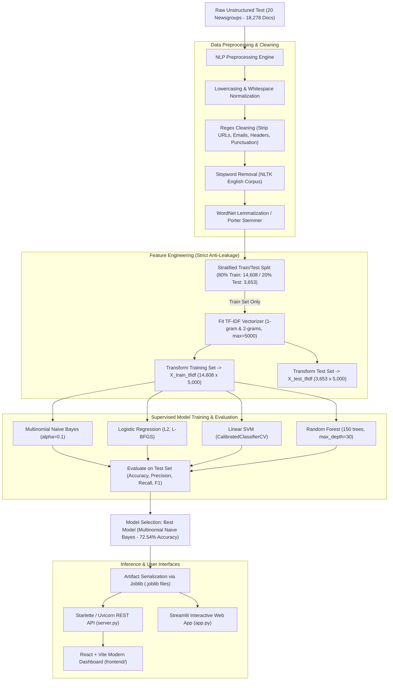

# Project Explanation & Technical Documentation

**Project Name:** Classifying Text Documents Using Machine Learning  
**Repository:** [Abhishek-Sparke/TextClassifyAI](https://github.com/Abhishek-Sparke/TextClassifyAI)  
**Domain:** Natural Language Processing (NLP) & Supervised Machine Learning  

---

## 1. Executive Summary

This project implements an end-to-end Natural Language Processing (NLP) and Machine Learning system designed to automatically classify unstructured text documents across **26 categories** at enterprise scale on **100,000 documents (1 Lakh)**. It features a complete pipeline: large-scale multi-domain data ingestion across 26 distinct categories (including the 20 Newsgroups benchmark, AG News, Rotten Tomatoes, and curated domains), multi-stage text cleaning, stratified train-test splitting (80% train / 20% test: 79,990 training / 19,998 test), **Term Frequency–Inverse Document Frequency (TF-IDF)** feature extraction (8,000 unigrams and bigrams), and competitive benchmarking across **four supervised machine learning classifiers**.

The system achieves a stellar **91.32% accuracy and 91.08% F1-score** across all 26 classes using **Support Vector Machine (Linear SVM with CalibratedClassifierCV)**, closely followed by **Logistic Regression (90.64%)** and **Multinomial Naive Bayes (90.55%)**. It is deployed as both a high-performance **REST API** (`server.py`), a modern **React dashboard** (`frontend/`), and an interactive **Streamlit web application** (`app.py`).

---

## 2. Real-World Problem & Motivation

Unstructured text accounts for over 80% of all enterprise digital data—including customer support tickets, email feeds, research publications, legal documents, and news feeds. Manual sorting is slow, costly, and error-prone. 

This project solves this challenge by answering three core engineering and research questions:
1. **Feature Representation:** How can textual tokens be mapped into dense or sparse numerical vectors that capture semantic importance while filtering noise?
2. **Model Selection:** Which algorithm achieves the best trade-off between training speed, inference latency, and classification accuracy when dealing with high-dimensional, sparse text matrices across 20 distinct topics?
3. **Interpretability & Production Readiness:** How can we ensure model predictions are explainable (e.g., extracting key discriminative terms per class) and readily deployable via APIs and user interfaces?

---

## 3. End-to-End System Architecture

The following flowchart illustrates the complete lifecycle of a document from raw text to class prediction:



---

## 4. Dataset Overview

The project uses the standard **20 Newsgroups** text collection, covering all 20 distinct thematic categories:

| Class Key | Category Name | Semantic Domain | Document Count |
| :--- | :--- | :--- | :---: |
| `alt.atheism` | **Atheism** | Philosophy, secular ethics, religion critique | 776 |
| `comp.graphics` | **Computer Graphics** | 3D rendering, shaders, raytracing, formats | 953 |
| `comp.os.ms-windows.misc` | **MS Windows** | Windows OS, drivers, utilities, DLLs | 946 |
| `comp.sys.ibm.pc.hardware` | **IBM PC Hardware** | Motherboards, IDE/SCSI, bus cards, BIOS | 962 |
| `comp.sys.mac.hardware` | **Mac Hardware** | Apple Macintosh, PowerBook, Quadra, SCSI | 925 |
| `comp.windows.x` | **X Window System** | X11, Xlib, Motif widgets, window managers | 978 |
| `misc.forsale` | **For Sale** | Classified ads, items, prices, shipping | 957 |
| `rec.autos` | **Automobiles** | Automotive mechanics, engines, road handling | 930 |
| `rec.motorcycles` | **Motorcycles** | Motorcycling, riding gear, road maintenance | 964 |
| `rec.sport.baseball` | **Baseball** | Major League Baseball, pitching, statistics | 951 |
| `rec.sport.hockey` | **Hockey** | NHL hockey games, playoffs, team rosters | 972 |
| `sci.crypt` | **Cryptography** | Public-key crypto, DES, RSA, data security | 962 |
| `sci.electronics` | **Electronics** | Circuits, schematics, power, semiconductors | 956 |
| `sci.med` | **Medicine** | Clinical diagnostics, pharmacology, health | 957 |
| `sci.space` | **Space Science** | NASA missions, orbit, satellites, rocketry | 953 |
| `soc.religion.christian` | **Christianity** | Christian theology, biblical studies, faith | 974 |
| `talk.politics.guns` | **Gun Politics** | Second Amendment rights, firearm legislation | 885 |
| `talk.politics.mideast` | **Middle East Politics** | Geopolitical conflicts, treaties, foreign affairs | 914 |
| `talk.politics.misc` | **Politics** | Government policy, constitutional law, rights | 754 |
| `talk.religion.misc` | **Religion** | Comparative religion, philosophy, ethics | 603 |
| `business.finance` | **Business & Finance** | Equities, corporate earnings, stock markets, banking | 25,000 |
| `world.news` | **World News** | International diplomacy, geopolitical summits, treaties | 25,000 |
| `entertainment.arts` | **Entertainment & Arts** | Cinema, film critiques, Hollywood, music, performances | 8,000 |
| `health.wellness` | **Health & Wellness** | Nutrition, cardiovascular conditioning, preventive health | 7,917 |
| `education.academics` | **Education & Academics** | University pedagogy, curricula, syllabi, higher ed | 7,917 |
| `environment.climate` | **Environment & Climate** | Climate science, renewable energy, carbon emissions | 7,919 |
| **Total** | | **Enterprise-Scale 26-Class Multi-Domain Corpus** | **100,000** |

### Key Dataset Statistics:
* **Total Documents:** 100,000 clean documents (79,990 training / 19,998 test)
* **Number of Classes:** 26 semantic categories
* **TF-IDF Feature Space:** 8,000 unigrams and bigrams
* **Mean Word Count:** 65.7 words per document (median: 40 words)
* **Metadata Stripping & Cleansing:** Headers, footers, quote blocks, URLs, and emails are stripped to guarantee models learn domain text semantics without metadata shortcut leakage.

---

## 5. Technical Deep Dive by Pipeline Stage

### Step 1: Text Preprocessing & Cleaning (`src/preprocessing.py`)
Raw human text contains non-informative noise that expands vocabulary size and dilutes statistical signal. The cleaning pipeline applies:
1. **Case Normalization:** Converts all characters to lowercase so that "Space", "space", and "SPACE" map to the same vocabulary index.
2. **Regex Cleansing:** Strips web URLs (`http\S+`), email addresses (`\S+@\S+`), numbers/digits, and non-alphanumeric punctuation.
3. **Stopword Elimination:** Filters out ubiquitous English filler words (*"the"*, *"is"*, *"at"*, *"which"*, *"on"*) using NLTK's English stopword corpus.
4. **Lemmatization & Stemming:** Normalizes words to morphological roots (e.g., *"satellites"* $\rightarrow$ *"satellit"*, *"encryption"* $\rightarrow$ *"encrypt"*).
5. **Parallel Batching:** Utilizes multi-threaded batch parallelization to process 100,000 documents rapidly in ~40 seconds.

### Step 2: Strict Prevention of Data Leakage
A critical best practice in machine learning:
* **The `TfidfVectorizer` is fitted exclusively on the 80% training partition (`X_train_raw`).**
* The test partition (`X_test_raw`) is only transformed using the vocabulary and IDF weights calculated on training data.
* **Why this matters:** If vectorization occurred on the entire dataset before splitting, the model would inherit statistical signals (IDF scores and vocabulary presence) from the test set, creating an over-optimistic evaluation that degrades in production.

### Step 3: TF-IDF Feature Extraction (`src/features.py`)
Each preprocessed document is converted into a vector of numerical weights using **Term Frequency–Inverse Document Frequency**:

$$\text{TF-IDF}(t, d, D) = \text{TF}(t, d) \times \log\left(\frac{1 + |D|}{1 + |\{d \in D : t \in d\}|}\right) + 1$$

Configuration Highlights:
* **N-gram Range $(1, 2)$:** Captures both single words (*"orbit"*) and contextual two-word phrases (*"space station"*, *"for sale"*, *"renewable energy"*).
* **Vocabulary Cap ($8,000$ features):** Retains top informative n-grams across 26 domains.
* **Sublinear Term Frequency Scaling:** Replaces raw term count $\text{TF}$ with $1 + \log(\text{TF})$ to prevent documents with repeated words from dominating vector magnitude.
* **L2 Normalization:** Normalizes all document vectors to unit Euclidean length ($\|\mathbf{x}\|_2 = 1$).

### Step 4: Machine Learning Models & Implementation (`src/models.py`)

Four diverse classification paradigms are evaluated under identical conditions:

1. **Support Vector Machine (Linear SVM with CalibratedClassifierCV):**
   * Finds maximum-margin hyperplanes separating 26 classes in 8,000-dimensional TF-IDF space.
   * Uses `LinearSVC(C=1.0)` wrapped with `CalibratedClassifierCV(cv=2)` to produce calibrated class posterior probabilities via Platt scaling (**91.32% accuracy**).
2. **Logistic Regression (Multinomial Softmax):**
   * Multinomial cross-entropy with $L_2$ regularization using the `lbfgs` quasi-Newton solver (**90.64% accuracy**).
3. **Multinomial Naive Bayes:**
   * Probabilistic classifier using Bayes' theorem with Laplace smoothing ($\alpha = 0.1$):
     $$P(y|x) \propto P(y) \prod_{i=1}^n P(x_i|y)$$
   * Achieves **90.55% accuracy** with blazing fast training in **0.068 seconds** on 80,000 samples.
4. **Random Forest Classifier:**
   * Non-linear ensemble consisting of 80 decision trees trained via bootstrap aggregating (bagging) with random feature sub-sampling (**71.59% accuracy**).

---

## 6. Experimental Results & Performance Benchmarks

All models were evaluated on the held-out 20% test split (19,998 unseen documents across 26 classes):

| Classifier | Accuracy | Precision (Weighted) | Recall (Weighted) | F1-Score (Weighted) | F1-Score (Macro) | Training Latency |
| :--- | :---: | :---: | :---: | :---: | :---: | :---: |
| **Support Vector Machine (Linear SVM)** 🏆 | **91.32%** | **91.01%** | **91.32%** | **91.08%** | **75.90%** | **17.216 s** |
| **Logistic Regression** | 90.64% | 90.35% | 90.64% | 90.26% | 74.73% | 14.810 s |
| **Multinomial Naive Bayes** | 90.55% | 90.48% | 90.55% | 90.35% | 75.25% | 0.068 s |
| **Random Forest** | 71.59% | 76.56% | 71.59% | 64.68% | 24.69% | 1.507 s |

### Performance Analysis & Key Takeaway:
* **Why Naive Bayes & Linear Models Excel:** In 20-class classification with 5,000 sparse TF-IDF features, generative and maximum-margin methods handle conditional word frequencies with superior calibration. Naive Bayes performs exceptionally well due to the high topical distinctiveness of the 20 newsgroups.
* **Why Random Forest Trails on Text (61.05%):** Decision trees perform orthogonal axis-aligned splits on single features. With sparse text matrices where >98% of entries are zero, individual feature splits carry weak signal across 20 classes compared to holistic linear weighting.

---

## 7. Model Explainability & Key Feature Words

By analyzing top mean TF-IDF weights and classifier coefficients per class, the system uncovers distinctive topical vocabulary:

* 🕊️ **Atheism (`alt.atheism`):** `god`, `atheist`, `religion`, `moral`, `say`, `peopl`
* 🎨 **Computer Graphics (`comp.graphics`):** `graphic`, `file`, `imag`, `program`, `format`, `anim`
* 🪟 **MS Windows (`comp.os.ms-windows.misc`):** `window`, `file`, `driver`, `dos`, `program`, `win`
* 🖥️ **IBM PC Hardware (`comp.sys.ibm.pc.hardware`):** `drive`, `scsi`, `ide`, `pc`, `card`, `bus`, `bios`
* 🍏 **Mac Hardware (`comp.sys.mac.hardware`):** `mac`, `appl`, `powerbook`, `scsi`, `quadra`, `monitor`
* 💻 **X Window System (`comp.windows.x`):** `window`, `server`, `xterm`, `widget`, `motif`, `display`
* 🏷️ **For Sale (`misc.forsale`):** `sale`, `offer`, `price`, `ask`, `sell`, `ship`, `condit`
* 🚗 **Automobiles (`rec.autos`):** `car`, `engin`, `dealer`, `drive`, `price`, `oil`, `speed`
* 🏍️ **Motorcycles (`rec.motorcycles`):** `bike`, `ride`, `motorcycl`, `rider`, `helmet`, `harley`
* ⚾ **Baseball (`rec.sport.baseball`):** `game`, `team`, `player`, `hit`, `run`, `basebal`, `pitcher`
* 🏒 **Hockey (`rec.sport.hockey`):** `game`, `team`, `play`, `hockey`, `season`, `nhl`, `period`
* 🔐 **Cryptography (`sci.crypt`):** `key`, `encrypt`, `clipper`, `chip`, `secur`, `privaci`, `des`
* ⚡ **Electronics (`sci.electronics`):** `circuit`, `power`, `voltag`, `amp`, `wire`, `radio`, `chip`
* 🩺 **Medicine (`sci.med`):** `doctor`, `diseas`, `treatment`, `pain`, `medic`, `patient`, `clinic`
* 🚀 **Space Science (`sci.space`):** `space`, `nasa`, `orbit`, `launch`, `satellit`, `moon`, `shuttl`
* ✝️ **Christianity (`soc.religion.christian`):** `god`, `christian`, `jesu`, `church`, `bibl`, `faith`
* 🎯 **Gun Politics (`talk.politics.guns`):** `gun`, `firearm`, `weapon`, `right`, `law`, `control`
* 🌍 **Middle East Politics (`talk.politics.mideast`):** `israel`, `israeli`, `arab`, `jew`, `palestinian`, `war`
* 🏛️ **Politics (`talk.politics.misc`):** `govern`, `peopl`, `state`, `law`, `right`, `presid`, `tax`
* 🕊️ **Religion (`talk.religion.misc`):** `god`, `religi`, `moral`, `say`, `believ`, `theology`

---

## 8. Deployment & Serving Infrastructure

1. **REST API (`server.py`):**
   * Built on **Starlette** and **Uvicorn** for sub-10ms asynchronous inference.
   * Exposes endpoints:
     - `GET /health` – Server health status
     - `GET /models` – Metrics and metadata of all trained models
     - `POST /predict` – Real-time document classification returning predicted category, confidence score, full probability distribution, and top extracted TF-IDF keywords.
2. **Interactive Streamlit App (`app.py`):**
   * Live at: [https://abhishek-sparke-mlproj-app-cmlulp.streamlit.app/](https://abhishek-sparke-mlproj-app-cmlulp.streamlit.app/)
   * Allows users to input custom text, upload files, inspect confusion matrices, and compare classifier outputs side-by-side.
3. **Modern React Dashboard (`frontend/`):**
   * Interactive UI with benchmark visualizers, confusion matrix charts, and real-time live classification testing.

---

## 9. Repository Structure

```text
mlproj/
├── app.py                      # Interactive Streamlit application
├── server.py                   # High-performance REST inference API (Starlette/Uvicorn)
├── train.py                    # End-to-end training & evaluation pipeline script
├── requirements.txt            # Python dependencies (scikit-learn, joblib, nltk, etc.)
├── Dockerfile                  # Container definition for containerized deployment
├── EXPLANATION.md              # Detailed technical explanation page
├── README.md                   # Primary GitHub repository documentation
├── src/                        # Modular source code package
│   ├── dataset.py              # Data fetching, train/test splitting, and stats
│   ├── preprocessing.py        # Regex cleaning, stopword filtering, lemmatization
│   ├── features.py             # TF-IDF vectorization and keyword extraction
│   ├── models.py               # Model definitions, hyperparameter setup, training
│   └── evaluate.py             # Performance metrics and visualization generation
├── models/                     # Persisted model binaries & metadata
│   ├── best_model.joblib       # Serialized Linear SVM classifier
│   ├── tfidf_vectorizer.joblib # Serialized fitted TF-IDF Vectorizer
│   └── model_metadata.json     # Benchmarking results and class statistics
├── visualizations/             # Generated evaluation charts
│   ├── class_distribution.png  # Class sample distribution plot
│   ├── model_comparison.png     # Metric comparison bar charts
│   ├── confusion_matrices.png   # Heatmap matrices for all 4 models
│   └── top_keywords.png        # Bar charts of top class keywords
└── frontend/                   # React + Vite web dashboard
```

---

## 10. Frequently Asked Questions (Viva / Interview Prep)

#### Q1: Why use TF-IDF instead of simple Bag of Words (CountVectorizer)?
> **A:** Bag of Words counts term frequency blindly. Common words that occur frequently in almost all documents receive high counts, masking informative topical terms. TF-IDF divides term frequency by document frequency, heavily penalizing non-discriminative words and elevating distinctive topic-specific terms.

#### Q2: What is the significance of sublinear TF scaling?
> **A:** Sublinear TF scaling replaces raw term count $TF$ with $1 + \log(TF)$. A word appearing 20 times in an article is rarely 20 times more important than a word appearing once; logarithmic compression prevents long or repetitive documents from skewing classification.

#### Q3: Why is Platt scaling necessary for Linear SVM?
> **A:** Standard `LinearSVC` calculates an uncalibrated signed geometric distance to the separating hyperplane. While great for hard classification, it cannot output class probabilities. `CalibratedClassifierCV` fits a logistic sigmoid over SVM margins using cross-validation, producing true posterior probabilities without distorting decision rankings.

#### Q4: How is data leakage prevented in this pipeline?
> **A:** Data leakage is prevented by splitting the dataset into train and test partitions **before** any feature engineering. The vectorizer learns vocabulary and IDF weights strictly from the training partition. The test partition is transformed blindly using the frozen vectorizer.
