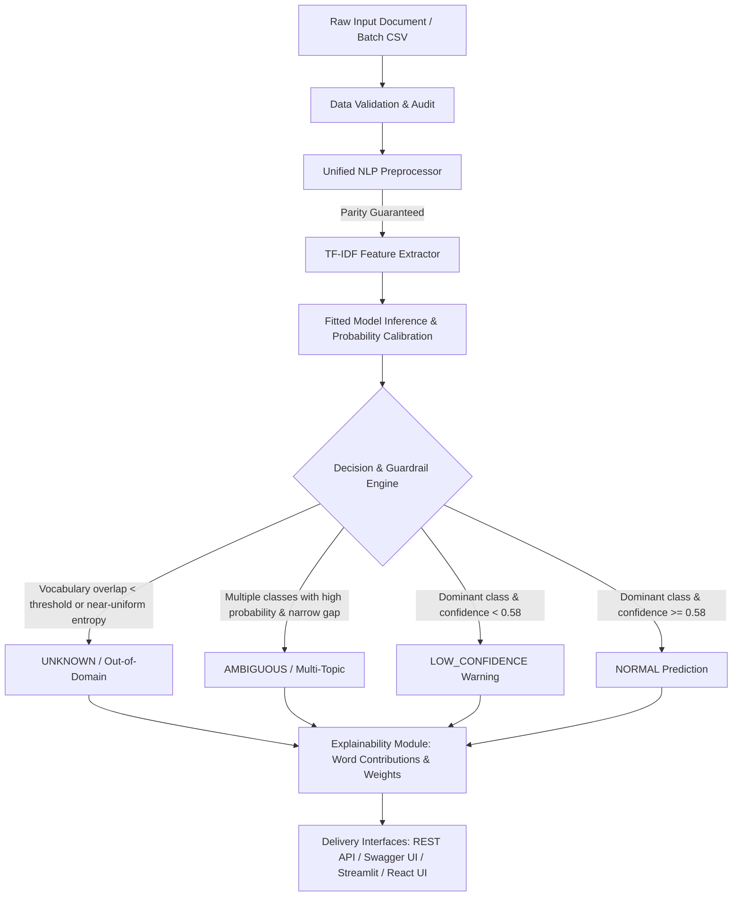

# TextClassify AI: Robust 4-Class NLP Text Classification Platform

[](https://www.python.org/downloads/)
[](https://scikit-learn.org/)
[](https://fastapi.tiangolo.com/)
[](https://streamlit.io/)
[](https://vitejs.dev/)
[](https://github.com/)

An end-to-end Machine Learning document classification platform engineered for real-world robustness. Rather than assuming every input belongs perfectly to one of the four categories, the engine distinguishes between **Normal in-domain text**, **Ambiguous multi-topic queries**, and **Unknown / Out-of-Domain text** using calibrated probability distributions, configurable decision boundaries, and comprehensive feature explainability.

---

## 🏗️ Architecture & Pipeline Overview



---

## 🎯 Target Categories

The classifier specializes in four core target domains from the 20 Newsgroups benchmark:

1. `comp.graphics` — Computer Graphics (3D rendering, GPU shaders, polygon meshes, ray tracing, CAD)
2. `rec.sport.baseball` — Baseball (pitchers, home runs, innings, strikeouts, league playoffs)
3. `sci.space` — Space Science (NASA launches, orbiters, planetary astrophysics, Hubble telescope)
4. `talk.politics.misc` — Politics (legislation, federal government, senate hearings, constitutional rights)

---

## 🛡️ Guardrails: Out-of-Domain & Ambiguity Detection

Real-world text rarely fits cleanly into pre-determined categories. The engine evaluates probability distributions and active feature densities across four operational statuses:

| Status | Meaning | Condition |
| :--- | :--- | :--- |
| **NORMAL** | High-confidence in-domain prediction | Single dominant class ($P_1 \ge 0.58$) and low topical competition. |
| **LOW_CONFIDENCE** | In-domain vocabulary, but marginal confidence | In-domain words present, but $P_1 < 0.58$ and not ambiguous. |
| **AMBIGUOUS** | Multi-topic or mixed-domain text | Multiple competing topics ($P_1, P_2 \ge 0.15$), gap $P_1 - P_2 \le 0.60$, and $\ge 2$ active domain keywords. |
| **UNKNOWN** | Out-of-Domain (OOD) text | Zero or near-zero vocabulary overlap ($< 0.05$), or near-uniform flat entropy ($P_1 < 0.35$ or spread $< 0.12$). |

### Spotlight Benchmark Cases

* **Mixed Benchmark:** *"The Chief Minister bought a Royal Enfield bike and went to Mars to see Jesus and play football."*
  * **Status:** `AMBIGUOUS`
  * **Competing Topics:** Baseball (Sports), Space Science, Politics, Computer Graphics
  * **Decision Reason:** Multiple competing topics detected; top-2 probability gap 12.51%.
* **Unrelated / OOD:** *"Pizza is my favorite food."*
  * **Status:** `UNKNOWN`
  * **Decision Reason:** Model confidence is nearly uniform across all classes (max 32.3%, spread 12.6%).
* **Mixed Topics:** *"The government announced a new Mars mission."*
  * **Status:** `AMBIGUOUS` (Space Science: 47.5%, Politics: 30.8%).

---

## 📊 Model Performance & Benchmarks

All models were evaluated on the **same untouched stratified test partition** (547 samples). Hyperparameters were tuned strictly on training data using **Stratified 5-Fold GridSearchCV**.

### Final Untouched Test Set Evaluation

| Model | Accuracy | Precision (Weighted) | Recall (Weighted) | F1-Score (Weighted) | F1-Score (Macro) | Training Time (s) | Latency (ms/doc) | Model Size (KB) |
| :--- | :---: | :---: | :---: | :---: | :---: | :---: | :---: | :---: |
| **Logistic Regression (Best)** | **0.8629** | **0.8633** | **0.8629** | **0.8630** | **0.8635** | 0.908s | 0.001 ms | 157.1 KB |
| **SGDClassifier** | 0.8629 | 0.8632 | 0.8629 | 0.8629 | 0.8634 | 0.478s | 0.001 ms | 157.4 KB |
| **Ridge Classifier** | 0.8629 | 0.8629 | 0.8629 | 0.8628 | 0.8632 | 0.273s | 0.008 ms | 628.6 KB |
| **Linear SVM** | 0.8611 | 0.8611 | 0.8611 | 0.8610 | 0.8614 | 0.214s | 0.005 ms | 628.0 KB |
| **Multinomial Naive Bayes** | 0.8592 | 0.8593 | 0.8592 | 0.8590 | 0.8596 | 4.165s | 0.001 ms | 313.3 KB |
| **Complement Naive Bayes** | 0.8556 | 0.8592 | 0.8556 | 0.8552 | 0.8558 | 0.229s | 0.001 ms | 352.4 KB |
| **Random Forest** | 0.7934 | 0.8053 | 0.7934 | 0.7951 | 0.7970 | 0.227s | 0.055 ms | 2643.1 KB |

### Stratified 5-Fold Cross-Validation (Training Set Only)

| Model | CV Mean F1 (Weighted) | CV Std F1 | CV Mean Accuracy | CV Std Accuracy |
| :--- | :---: | :---: | :---: | :---: |
| Complement Naive Bayes | 0.8729 | 0.0094 | 0.8739 | 0.0098 |
| Multinomial Naive Bayes | 0.8574 | 0.0075 | 0.8579 | 0.0077 |
| Linear SVM | 0.8445 | 0.0111 | 0.8446 | 0.0113 |
| Ridge Classifier | 0.8440 | 0.0116 | 0.8441 | 0.0117 |
| SGDClassifier | 0.8439 | 0.0109 | 0.8441 | 0.0111 |
| Logistic Regression | 0.8418 | 0.0132 | 0.8419 | 0.0133 |
| Random Forest | 0.7816 | 0.0118 | 0.7797 | 0.0117 |

---

## 🔬 Forensic Error Analysis

Deep-dive evaluation on the 75 test set errors (13.71% error rate) revealed key insights:

### Error Rate by Document Length Slice
- **Short Texts (< 25 words):** 57 errors / 244 docs (**23.36% error rate**). Extreme brevity reduces topical TF-IDF feature density.
- **Medium Texts (25–120 words):** 15 errors / 217 docs (**6.91% error rate**).
- **Long Texts (> 120 words):** 3 errors / 86 docs (**3.49% error rate**). High reliability on comprehensive documents.

### Frequently Confused Category Pairs
1. `comp.graphics` $\rightarrow$ `sci.space` (10 errors): Cross-domain terms like "rendering", "simulation", "orbit", "visualization".
2. `sci.space` $\rightarrow$ `talk.politics.misc` (9 errors): NASA budget allocations, congressional appropriations.
3. `talk.politics.misc` $\rightarrow$ `sci.space` (9 errors): Government space treaties, defense satellites.
4. `rec.sport.baseball` $\rightarrow$ `comp.graphics` (8 errors): Short scoreboard listings, graphical stats.

---

## 🔍 Explainability & Feature Attribution

For each prediction, the system provides:
1. **Active TF-IDF Weights:** Terms from the document that matched the vocabulary.
2. **Word Contribution Attribution:** For linear classifiers (Logistic Regression, Linear SVM, SGD), word contribution scores are calculated as:
   $$c_{k, j} = w_{k, j} \cdot x_j$$
   where $w_{k, j}$ is the trained coefficient for class $k$ and feature $j$, and $x_j$ is the TF-IDF weight.
3. **Statistical Attribution Disclaimer:** Word weights reflect empirical statistical associations within the training corpus and do not imply causal understanding or human semantic reasoning.

---

## 📁 Dataset Provenance & Data Pipeline Audit

- **Total Documents Audited:** 3,689 raw entries.
- **Removed (Empty / Whitespace):** 856 documents.
- **Removed (Extremely Short < 15 chars):** 137 documents.
- **Truncated (> 50,000 chars):** 8 documents to prevent denial of service.
- **Duplicates Removed:** 39 exact duplicates + 9 post-preprocessing duplicates.
- **Domain Augmentations Appended:** 57 curated short-text examples.
- **Final Cleaned Corpus:** 2,744 documents.
- **Data Leakage Check:** PASS (Zero overlap between train and test splits).
- **Cryptographic Fingerprint (SHA-256):** `15c0a10bf2fa2b17`.

---

## 🚀 Quickstart & Usage

### 1. Setup Environment
```bash
# Clone the repository
git clone https://github.com/Abhishek-Sparke/TextClassifyAI.git
cd mlproj

# Create and activate virtual environment
python -m venv .venv
source .venv/bin/activate  # On Windows: .venv\Scripts\activate

# Install dependencies
pip install -r requirements.txt
```

### 2. Run Training & Evaluation Pipeline
```bash
python train.py
```
This executes dataset validation, 5-fold CV hyperparameter tuning, evaluation, error analysis, artifact validation, and saves 6 visualization plots to `visualizations/`.

### 3. Run Automated Tests
```bash
# Run unit & API integration test suite
python tests/test_pipeline.py

# Run comprehensive stress test suite (55+ cases)
python tests/stress_tests.py
```

### 4. Start Local REST API & Swagger UI
```bash
python server.py
```
- API Base: `http://localhost:8000`
- Interactive Swagger UI: `http://localhost:8000/docs`
- ReDoc Documentation: `http://localhost:8000/redoc`
- OpenAPI Specification: `http://localhost:8000/openapi.json`

### 5. Launch Streamlit ML Dashboard
```bash
streamlit run app.py
```
Access all 8 dashboard sections: Single Predict, Batch CSV, Model Info, Confidence Analysis, Explainability, Evaluation, Error Analysis, and Dataset Stats.

### 6. Build or Run React Frontend
```bash
cd frontend
npm install
npm run build   # Production bundle in frontend/dist
npm run dev     # Local development server
```

---

## 🔌 API Endpoints Summary

| Method | Endpoint | Description |
| :--- | :--- | :--- |
| `GET` | `/health` | Health check, active model, and dataset fingerprint |
| `GET` | `/models` | Metrics table, hyperparameters, and CV scores |
| `POST` | `/predict` | Single text classification |
| `POST` | `/predict/batch` | Batch classification (max 500 documents) |
| `POST` | `/explain` | Feature contribution & word-level explainability |
| `POST` | `/api/upload` | File upload handling (txt, csv, json) |
| `GET` | `/docs` | Interactive Swagger UI documentation |
| `GET` | `/openapi.json` | OpenAPI 3.0 schema |

---

## ⚠️ Known Project Limitations

1. **Four Primary Target Classes:** The model was trained specifically on four domains (Computer Graphics, Baseball, Space Science, Politics). Unseen domains without clear keyword overlaps are detected as Unknown, but polysemous words can occasionally cause misclassifications.
2. **Confidence $\ne$ Human Certainty:** Softmax probabilities reflect normalized linear logits, not calibrated Bayesian real-world certainty.
3. **Short Text Sensitivity:** Error rate increases to 23.36% on texts under 25 words due to limited n-gram feature representation.
4. **Keyword Specificity:** Training data for baseball does not generalize to soccer, cricket, or basketball.

---

## 📄 License & Attribution

This project is licensed under the Apache 2.0 License. Developed for robust production text classification.
