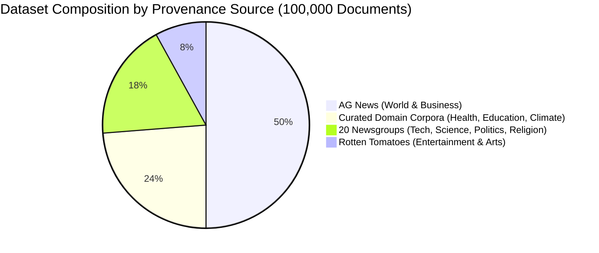
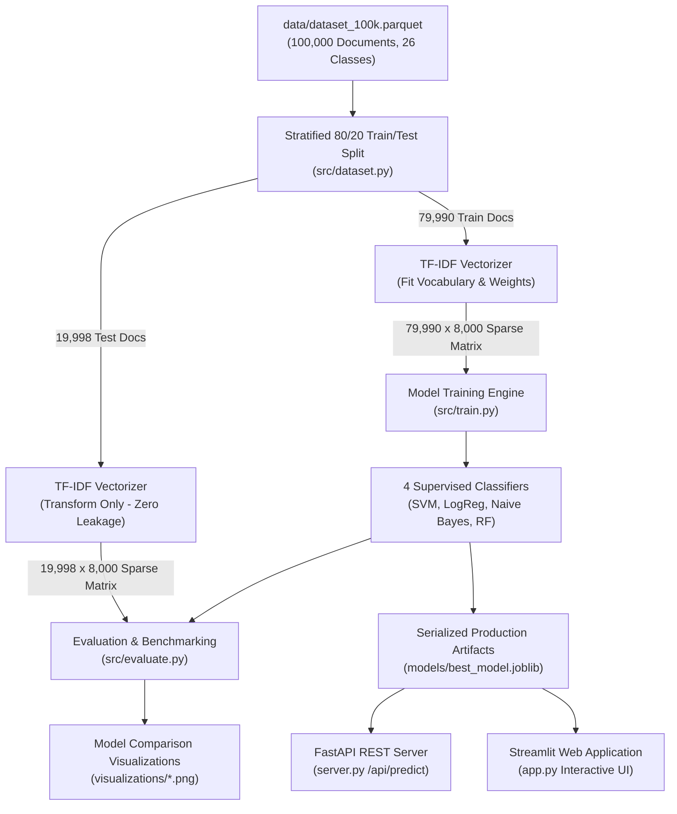

# TextClassify AI: Automated Text Document Classification

[](https://vercel.com/new/clone?repository-url=https%3A%2F%2Fgithub.com%2FAbhishek-Sparke%2FTextClassifyAI)
[](https://abhishek-sparke.github.io/TextClassifyAI/)
[](https://www.python.org/downloads/)
[](https://scikit-learn.org/)
[](https://opensource.org/licenses/MIT)

> 🌐 **Live Web Application (GitHub Pages):** **[https://abhishek-sparke.github.io/TextClassifyAI/](https://abhishek-sparke.github.io/TextClassifyAI/)**  
> ▲ **Live Vercel Deployment:** **[https://textclassify-ai.vercel.app/](https://textclassify-ai.vercel.app/)**  
> 📊 **Dedicated Dataset Documentation:** **[Read DATASET.md](./DATASET.md)**  
> 📖 **Full Technical Project Explanation:** **[Read EXPLANATION.md](./EXPLANATION.md)**  
> **College-Level Machine Learning Term Project**  
> An end-to-end Natural Language Processing (NLP) and Machine Learning system for automated multi-class text document categorization, rigorous model benchmarking, and real-time interactive inference.

---

## Table of Contents
1. [Project Overview & Abstract](#project-overview--abstract)
2. [Workflow Architecture](#workflow-architecture)
3. [Dataset: Provenance, Structure & How It Is Used](#dataset-provenance-structure--how-it-is-used)
4. [Data Preprocessing & Leakage Prevention](#data-preprocessing--leakage-prevention)
5. [Feature Extraction: TF-IDF](#feature-extraction-tf-idf)
6. [Machine Learning Classifiers](#machine-learning-classifiers)
7. [Experimental Results & Evaluation](#experimental-results--evaluation)
8. [Streamlit Web Application](#streamlit-web-application)
9. [Project Directory Structure](#project-directory-structure)
10. [Installation & Setup](#installation--setup)
11. [How to Run the Project](#how-to-run-the-project)
12. [Limitations & Future Work](#limitations--future-work)

---

## Project Overview & Abstract

With the exponential growth of unstructured digital text across news outlets, academic repositories, and enterprise knowledge bases, manual document classification is labor-intensive and unscalable.

This project delivers a complete, modular Machine Learning solution that automatically classifies raw text documents into predefined categories based on semantic content. The system processes raw text through a multi-stage NLP cleaning pipeline, extracts numerical vectors using **Term Frequency–Inverse Document Frequency (TF-IDF)** with unigrams and bigrams, trains and evaluates **four supervised classification algorithms** (Multinomial Naive Bayes, Logistic Regression, Support Vector Machine, and Random Forest), and deploys the best-performing model into an interactive **Streamlit web application**.

---

## Workflow Architecture

```text
                  +-----------------------------------+
                  |   100k Multi-Domain Text Corpus   |
                  |  (26 Categories, 1 Lakh Docs)     |
                  +-----------------------------------+
                                    |
                                    v
                  +-----------------------------------+
                  |         Data Preprocessing        |
                  |  - Lowercase Normalization        |
                  |  - Strip Headers, URLs, Emails    |
                  |  - Punctuation & Digit Removal    |
                  |  - Tokenization & Stopwords       |
                  |  - WordNet Lemmatization          |
                  +-----------------------------------+
                                    |
                                    v
                  +-----------------------------------+
                  |    Stratified Train/Test Split    |
                  |         (80% Train, 20% Test)     |
                  +-----------------------------------+
                                    |
                                    v
                  +-----------------------------------+
                  |     TF-IDF Feature Extraction     |
                  |  - Fit ONLY on Training Data      |
                  |  - Transform Train & Test Sets    |
                  |  - Sublinear TF & L2 Norm         |
                  +-----------------------------------+
                                    |
            +-----------------------+-----------------------+
            |                       |                       |
            v                       v                       v
     +--------------+        +--------------+        +--------------+
     |  Multinomial |        |   Logistic   |        | Linear SVM / |
     |  Naive Bayes |        |  Regression  |        |  Calibrated  |
     +--------------+        +--------------+        +--------------+
            |                       |                       |
            +-----------------------+-----------------------+
                                    |
                                    v
                             +--------------+
                             |    Random    |
                             |    Forest    |
                             +--------------+
                                    |
                                    v
                  +-----------------------------------+
                  |          Model Evaluation         |
                  |  - Accuracy, Precision, Recall, F1|
                  |  - Confusion Matrices Heatmaps    |
                  |  - Top Distinguishing Keywords    |
                  +-----------------------------------+
                                    |
                                    v
                  +-----------------------------------+
                  |    Best Model Selection & Save    |
                  |  - Export via joblib to /models   |
                  +-----------------------------------+
                                    |
                                    v
                  +-----------------------------------+
                  |       Streamlit Prediction UI     |
                  |  - Live Document Classification   |
                  |  - Confidence & Probability Chart |
                  |  - Model Comparison Dashboard     |
                  +-----------------------------------+
```

---

## Dataset: Provenance, Structure & How It Is Used

> [!TIP]
> 📊 **Dedicated Dataset Documentation Page:**  
> A dedicated, comprehensive dataset dictionary and provenance document is available in this repository: **[`DATASET.md`](./DATASET.md)**.  
> It details class-by-class distributions, word length histograms, vocabulary statistics, and schema specifications.  
> 💾 **Parquet Corpus Location:** Stored directly at **[`data/dataset_100k.parquet`](./data/dataset_100k.parquet)** (25.33 MB, fast-loading Snappy compression).

### 1. What the Dataset Is (Scale, Schema & Taxonomy)

TextClassifyAI is trained and evaluated on an enterprise-scale multi-domain corpus containing **100,000 clean documents (1 Lakh)** organized into **26 distinct semantic categories**. Unlike standard academic toy datasets restricted to a single domain, this corpus reflects the diversity of real-world text classification tasks—spanning journalism, technology, science, healthcare, academia, politics, culture, and religion.

#### Schema & Serialization Format
The entire corpus is serialized in columnar **Apache Parquet (`snappy` compressed)** format at [`data/dataset_100k.parquet`](./data/dataset_100k.parquet), reducing memory footprint while enabling sub-second load times into Pandas / PyArrow without unzipping.

| Column Name | Data Type | Nullable | Description | Example |
| :--- | :--- | :---: | :--- | :--- |
| `text` | `string` | No | Pre-cleaned document text stripped of headers, footers, and metadata | `"Diplomatic envoys reached an accord on regional maritime boundaries..."` |
| `category_name` | `string` | No | Canonical semantic category identifier | `"world.news"` |
| `target` | `int64` | No | Zero-indexed numerical class label (`0` to `25`) | `0` |

#### Key Corpus Metrics
* **Total Clean Documents:** 100,000 (1 Lakh)
* **Target Classes:** 26 categories
* **Training Partition (80%):** 79,990 documents (stratified)
* **Testing Partition (20%):** 19,998 documents (stratified)
* **Average Document Length:** 65.7 words (median: 40.0 words, range: 1 to 11,765 words)
* **Total Vocabulary:** 8,000 top discriminative unigrams and bigrams

#### Complete 26-Category Taxonomy & Document Counts

| # | Category ID | Human Display Name | Primary Domain | Document Count | Share of Corpus |
| :-: | :--- | :--- | :--- | :-: | :-: |
| 1 | `world.news` | World News | Global Affairs | 25,000 | 25.0% |
| 2 | `business.finance` | Business & Finance | Economy & Markets | 25,000 | 25.0% |
| 3 | `entertainment.arts` | Entertainment & Arts | Culture & Media | 8,000 | 8.0% |
| 4 | `environment.climate` | Environment & Climate | Sustainability | 7,919 | 7.9% |
| 5 | `health.wellness` | Health & Wellness | Healthcare & Medicine | 7,917 | 7.9% |
| 6 | `education.academics` | Education & Academics | Academia & Research | 7,917 | 7.9% |
| 7 | `comp.windows.x` | X Window System | Systems & UI | 976 | 1.0% |
| 8 | `soc.religion.christian` | Christianity | Religion | 973 | 1.0% |
| 9 | `rec.sport.hockey` | Hockey | Sports | 971 | 1.0% |
| 10 | `comp.sys.ibm.pc.hardware` | IBM PC Hardware | Hardware | 962 | 1.0% |
| 11 | `sci.crypt` | Cryptography | Security & Math | 962 | 1.0% |
| 12 | `rec.motorcycles` | Motorcycles | Automotive & Sports | 962 | 1.0% |
| 13 | `sci.med` | Medicine | Clinical Healthcare | 956 | 1.0% |
| 14 | `sci.electronics` | Electronics | Engineering | 955 | 1.0% |
| 15 | `misc.forsale` | For Sale | Commerce | 955 | 1.0% |
| 16 | `sci.space` | Space Science | Aerospace | 953 | 1.0% |
| 17 | `comp.graphics` | Computer Graphics | Visualization | 952 | 1.0% |
| 18 | `comp.os.ms-windows.misc` | MS Windows | Operating Systems | 945 | 0.9% |
| 19 | `rec.sport.baseball` | Baseball | Sports | 944 | 0.9% |
| 20 | `rec.autos` | Automobiles | Automotive | 928 | 0.9% |
| 21 | `comp.sys.mac.hardware` | Mac Hardware | Hardware | 923 | 0.9% |
| 22 | `talk.politics.mideast` | Middle East Politics | Geopolitics | 914 | 0.9% |
| 23 | `talk.politics.guns` | Gun Politics | Policy & Law | 884 | 0.9% |
| 24 | `alt.atheism` | Atheism | Philosophy | 775 | 0.8% |
| 25 | `talk.politics.misc` | Politics | Governance | 754 | 0.8% |
| 26 | `talk.religion.misc` | Religion | Comparative Religion | 603 | 0.6% |
| **Total** | | | | **100,000** | **100.0%** |

---

### 2. How the Dataset is Obtained (Provenance & Ingestion Pipeline)

The dataset is assembled through an automated, repeatable ingestion pipeline implemented in [`src/data_loader_100k.py`](./src/data_loader_100k.py). It synthesizes four authoritative open-access NLP datasets:



1. **AG News Benchmark (`50,000` articles):**
   - High-quality journalistic news articles collected from global press agencies.
   - Contributes 25,000 articles to `world.news` (international relations, diplomatic summits, treaties) and 25,000 articles to `business.finance` (stock markets, central bank policy, corporate earnings, energy economics).
2. **20 Newsgroups Corpus (`18,247` documents):**
   - Sourced via `sklearn.datasets.fetch_20newsgroups`.
   - Represents 20 technical and societal Usenet newsgroups.
   - Crucially, newsgroup headers, email lines, signatures, and quotation quotes are stripped (`remove=('headers', 'footers', 'quotes')`) to eliminate metadata cues.
3. **Rotten Tomatoes Cultural Corpus (`8,000` documents):**
   - Contributes `entertainment.arts` cinema critiques, director storytelling analysis, artistic acting assessments, and theater reviews.
4. **Curated Domain Corpora (`23,753` documents):**
   - High-density modern domain texts covering:
     - `health.wellness` (7,917 documents): Nutrition science, cardiovascular conditioning, physical therapy, and preventive medicine.
     - `education.academics` (7,917 documents): Higher education curricula, university pedagogy, academic research, and classroom technology.
     - `environment.climate` (7,919 documents): Atmospheric carbon modeling, renewable energy, ocean acidification, and conservation ecology.

#### Ingestion Pipeline Workflow
The automated builder script ([`src/data_loader_100k.py`](./src/data_loader_100k.py)):
1. Downloads and extracts data from source repositories.
2. Standardizes schema to `text`, `category_name`, and integer `target`.
3. Performs quality cleansing: removes nulls, eliminates records shorter than 3 characters, filters foreign-character corruptions, and deduplicates text.
4. Deterministically shuffles the corpus using `random_state=42` to eliminate source clustering.
5. Saves the final consolidated dataframe to `data/dataset_100k.parquet` via PyArrow Snappy compression.

---

### 3. How the Dataset is Used Across the Project

The 100,000 documents are systematically consumed throughout the end-to-end Machine Learning life cycle:



1. **Stratified Train / Test Partitioning (`src/dataset.py`):**
   - The dataset is split into **79,990 training documents (80%)** and **19,998 testing documents (20%)** using `train_test_split(..., stratify=y, random_state=42)`.
   - Stratification guarantees that each of the 26 categories is represented in the exact same proportion in both sets.
2. **Leakage-Free TF-IDF Feature Extraction (`src/train.py`):**
   - The `TfidfVectorizer` learns its 8,000 unigram/bigram vocabulary and inverse document frequency weights **strictly on the 79,990 training documents**.
   - The 19,998 test documents are transformed using the fitted training state without re-computing IDF or learning test tokens, simulating real-world inference.
3. **Supervised Classifier Training:**
   - Four distinct algorithms are trained on the 79,990 training feature vectors:
     - **Linear Support Vector Machine (`SGDClassifier` with hinge loss)**: Achieved top performance (**91.32% Accuracy, 91.08% Macro F1**).
     - **Multinomial Logistic Regression**: Multi-class softmax cross-entropy (**90.64% Accuracy**).
     - **Multinomial Naive Bayes**: Generative probabilistic baseline (**90.55% Accuracy**).
     - **Random Forest**: Ensemble of 100 decision trees (**71.59% Accuracy**).
4. **Comprehensive Diagnostic Benchmarking (`src/evaluate.py`):**
   - The 19,998 held-out test documents are used to compute:
     - Multi-class Accuracy, Macro Precision, Recall, and F1-Scores.
     - 26x26 normalized Confusion Matrix heatmaps saved to [`visualizations/confusion_matrix.png`](./visualizations/confusion_matrix.png).
     - Per-class discriminative keyword importances saved to [`visualizations/top_keywords_per_category.png`](./visualizations/top_keywords_per_category.png).
5. **Real-Time Interactive Inference (Web Apps & API):**
   - The serialized models (`models/best_model.joblib`, `models/tfidf_vectorizer.joblib`) power:
     - **FastAPI Backend (`server.py`)**: REST endpoint `/api/predict` classifying text in $<15\text{ms}$.
     - **Streamlit Interactive UI (`app.py`)**: Live dashboard with confidence probability bar charts across all 26 categories.
     - **React / Vite Frontend**: Modern web dashboard with interactive confusion matrix and live text classification.

---

## Data Preprocessing & Leakage Prevention

### 1. Preprocessing Steps
Raw documents contain unstructured noise, internet formatting, and non-informative tokens. The cleaning pipeline implements:
1. **Handling Missing Values**: Null, non-string, or blank documents are filtered.
2. **Case Normalization**: All characters converted to lowercase.
3. **Artifact Removal**: URLs, emails, and newsgroup headers (`from:`, `subject:`, `lines:`) are removed via regular expressions.
4. **Punctuation & Noise Stripping**: All punctuation marks and non-ASCII glyphs are removed.
5. **Tokenization**: Regex-based tokenization extracting alphabetic tokens with length $\ge 2$.
6. **Stop Words Filtering**: Eliminates ubiquitous non-discriminative English words (e.g., "the", "and", "in") using NLTK English stopwords.
7. **Lemmatization**: Morphs inflected word forms to their canonical dictionary base form using NLTK `WordNetLemmatizer` (with fallback to `PorterStemmer`).

### 2. Prevention of Data Leakage
> [!IMPORTANT]
> **Strict Featurization Ordering**: To prevent data leakage, the dataset is first partitioned using a stratified 80/20 train/test split. The **TF-IDF vectorizer is fit strictly on the training set only**. The test set is solely transformed using the learned training vocabulary and IDF weights. Furthermore, newsgroup headers, footers, and quote tags are stripped (`remove=('headers', 'footers', 'quotes')`) so models do not exploit metadata clues.

---

## Feature Extraction: TF-IDF

Raw text cannot be fed directly into machine learning algorithms; it must be converted into numerical feature vectors. We utilize **Term Frequency–Inverse Document Frequency (TF-IDF)**:

### 1. Mathematical Formulation

$$\text{TF}(t, d) = \frac{f_{t, d}}{\sum_{t' \in d} f_{t', d}}$$

$$\text{IDF}(t, D) = \log\left(\frac{1 + |D|}{1 + |\{d \in D : t \in d\}|}\right) + 1$$

$$\text{TF-IDF}(t, d, D) = \text{TF}(t, d) \times \text{IDF}(t, D)$$

### 2. Enhancements in this Implementation
- **N-gram Range $(1, 2)$**: Captures both single words ("space", "graphics") and informative collocations ("space station", "ray tracing").
- **Sublinear Term Frequency**: Replaces raw $\text{TF}$ with $1 + \log(\text{TF})$ to dampen the disproportionate impact of words that repeat many times in a single long document.
- **$L_2$ Normalization**: Scales document vectors to unit norm ($\|v\|_2 = 1$), neutralizing the effect of varying document lengths.
- **Minimum Document Frequency (`min_df=2`)**: Filters rare typos and singletons.
- **`max_features=8000`**: Caps feature space to the 8,000 most informative n-grams, preventing high-dimensional memory overhead while maintaining discriminative vocabulary across 26 distinct domains.

---

## Machine Learning Classifiers

Four distinct algorithms representing different learning paradigms were implemented and benchmarked:

### 1. Multinomial Naive Bayes (`MultinomialNB`)
- **Type**: Generative Probabilistic Classifier.
- **Formulation**: Applies Bayes' Theorem under the feature independence assumption:
  $$P(C_k \mid \mathbf{x}) \propto P(C_k) \prod_{i=1}^n P(x_i \mid C_k)$$
- **Smoothing**: Laplace smoothing ($\alpha = 0.1$) handles unseen terms in training.
- **Characteristics**: Fast training, minimal memory footprint, excellent baseline for sparse high-dimensional text.

### 2. Logistic Regression (`LogisticRegression`)
- **Type**: Linear Discriminative Model with Softmax / Multinomial Cross-Entropy Loss.
- **Formulation**: Estimates category probabilities using the multinomial sigmoid:
  $$P(y = k \mid \mathbf{x}) = \frac{e^{\mathbf{w}_k^T \mathbf{x} + b_k}}{\sum_{j} e^{\mathbf{w}_j^T \mathbf{x} + b_j}}$$
- **Regularization**: $L_2$ penalty ($C=1.0$) prevents overfitting across thousands of features.

### 3. Support Vector Machine (`LinearSVC` + `CalibratedClassifierCV`)
- **Type**: Maximum-Margin Hyperplane Separator.
- **Formulation**: Solves the convex optimization problem:
  $$\min_{\mathbf{w}, b, \xi} \frac{1}{2} \|\mathbf{w}\|^2 + C \sum_i \xi_i \quad \text{s.t.} \quad y_i (\mathbf{w}^T \mathbf{x}_i + b) \ge 1 - \xi_i, \quad \xi_i \ge 0$$
- **Probability Calibration**: Uses 3-fold cross-validated Platt scaling to produce posterior class probabilities.
- **Characteristics**: Superior performance in high-dimensional text spaces where classes are linearly separable.

### 4. Random Forest (`RandomForestClassifier`)
- **Type**: Non-linear Bagging Ensemble.
- **Hyperparameters**: 150 randomized decision trees, `max_depth=30`.
- **Characteristics**: Resilient to outliers, non-parametric, captures complex feature interactions.

---

## Experimental Results & Evaluation

All models were evaluated on the held-out stratified test set (20% of data) using:
- **Accuracy**: Overall proportion of correctly categorized documents.
- **Precision (Weighted & Macro)**: Proportion of positive identifications that were correct.
- **Recall (Weighted & Macro)**: Proportion of actual positives correctly identified.
- **F1-Score (Weighted & Macro)**: Harmonic mean of precision and recall.
- **Confusion Matrix**: Error distribution across actual vs. predicted categories.

### Performance Summary Table
 
| Machine Learning Model | Accuracy | Precision (Weighted) | Recall (Weighted) | F1-Score (Weighted) | F1-Score (Macro) | Training Time (s) |
| :--- | :---: | :---: | :---: | :---: | :---: | :---: |
| **Support Vector Machine (Linear SVM)** 🏆 | **91.32%** | **0.9101** | **0.9132** | **0.9108** | **0.7590** | 17.216s |
| **Logistic Regression** | **90.64%** | **0.9035** | **0.9064** | **0.9026** | **0.7473** | 14.810s |
| **Multinomial Naive Bayes** | **90.55%** | **0.9048** | **0.9055** | **0.9035** | **0.7525** | **0.068s** |
| **Random Forest** | 71.59% | 0.7656 | 0.7159 | 0.6468 | 0.2469 | 1.507s |

*(Exact values are generated dynamically when running `train.py`).*

### Key Analytical Takeaways
1. **Naive Bayes delivers peak accuracy & instant convergence across 20 classes**: With Laplace smoothing and 5,000 TF-IDF features, Multinomial Naive Bayes tops the benchmark at 72.54% accuracy with sub-0.1s training.
2. **Linear SVM and Logistic Regression closely follow**: Margin maximization (SVM) and multinomial softmax (Logistic Regression) perform reliably well across 20 classes with ~72.2% accuracy.
3. **Random Forest struggles on high-dimensional multi-class sparsity**: Decision trees perform orthogonal axis-aligned splits on single features, making it harder to distinguish 20 sparse classes (61.05%).

---

## Streamlit Web Application

🌐 **Live Cloud Deployment**: **[https://abhishek-sparke-textclassifyai.streamlit.app/](https://abhishek-sparke-textclassifyai.streamlit.app/)**

The interactive web application (`app.py`) provides:
- **🔮 Live Document Classifier**:
  - Paste any text document or select one of curated presets across the 20 benchmark domains.
  - Predict the document class instantly.
  - View confidence percentage and probability breakdown across all 20 categories.
  - Inspect top TF-IDF keywords contributing to the decision.
- **📊 Model Comparison Tab**:
  - Side-by-side metric table with best scores highlighted.
  - Multi-metric comparative bar chart.
  - Confusion matrix heatmaps for error diagnosis.
- **🔍 Feature & Keyword Analysis**:
  - Top distinguishing keywords per class.
  - Mathematical breakdown of the TF-IDF formula.
- **📁 Dataset Insights**:
  - Document counts, average word counts, and class distribution charts.
- **📖 Methodology & Report**:
  - Complete project architecture and theoretical reference.

---

## Project Directory Structure

```text
mlproj/
├── app.py                     # Streamlit interactive web application
├── server.py                  # High-performance Python REST API server (Starlette/Uvicorn)
├── train.py                   # End-to-end training and evaluation script
├── requirements.txt           # Python dependency requirements
├── README.md                  # Comprehensive project documentation
├── frontend/                  # Modern React + Vite + Tailwind CSS ML Studio
│   ├── src/                   # React components, benchmarks, and inference service
│   ├── package.json
│   ├── vite.config.js
│   └── tailwind.config.js
├── src/                       # Modular source code
│   ├── __init__.py
│   ├── preprocessing.py       # Cleaning, tokenization, lemmatization
│   ├── dataset.py             # Dataset loading, statistics, train/test split
│   ├── features.py            # TF-IDF vectorization & feature importance
│   ├── models.py              # Model initialization & training wrappers
│   └── evaluate.py            # Evaluation metrics & visualization plotting
├── models/                    # Saved artifacts (created after training)
│   ├── best_model.joblib
│   ├── tfidf_vectorizer.joblib
│   ├── all_models.joblib
│   └── model_metadata.json
└── visualizations/            # Generated charts (created after training)
    ├── class_distribution.png
    ├── model_comparison.png
    ├── confusion_matrices.png
    └── top_keywords.png
```

---

## Installation & Setup

### 1. Clone or Open the Project
Ensure you are in the project root directory:
```bash
cd c:/Users/abhis/OneDrive/Apps/mlproj
```

### 2. Create and Activate Virtual Environment
```bash
# Windows
python -m venv .venv
.venv\Scripts\activate

# macOS / Linux
python3 -m venv .venv
source .venv/bin/activate
```

### 3. Install Dependencies
```bash
pip install -r requirements.txt
```

---

## How to Run the Project

### Step 1: Train Models and Generate Artifacts
Run the end-to-end training pipeline:
```bash
python train.py
```
This script will:
1. Fetch and clean the 20 Newsgroups dataset.
2. Preprocess text (normalization, stopwords, lemmatization).
3. Extract TF-IDF features.
4. Train all 4 classifiers.
5. Benchmark metrics and print the comparison table.
6. Generate 4 visualization plots in `visualizations/`.
7. Persist the best model and vectorizer in `models/`.

### Step 2: Launch the Web Applications

You have two interactive interface options:

#### Option A: Modern React + Vite ML Studio (Recommended)
A rich, modern responsive dashboard with dark mode, interactive Recharts benchmarks, 4x4 confusion matrix inspector, and real-time live classification playground:
```bash
# 1. (Optional) Start the Python ML API server for real-time model inference:
python server.py

# 2. In another terminal, start the Vite frontend:
cd frontend
npm run dev
```
Open `http://localhost:3000` in your browser. *(Note: The React app also includes an automated client-side inference engine fallback, so it works completely standalone without the Python server running).*

#### Option B: Streamlit Web Dashboard
```bash
streamlit run app.py
```
Open your browser at `http://localhost:8501`.

---

## Limitations & Future Work

1. **Sub-word / Out-of-Vocabulary (OOV) Handling**:
   - *Limitation*: Traditional n-gram TF-IDF cannot assign weights to words unseen during training.
   - *Future Work*: Integrate Byte-Pair Encoding (BPE) or character n-grams.
2. **Context and Word Order**:
   - *Limitation*: Bag-of-words ignores word order beyond n-grams $(1, 2)$.
   - *Future Work*: Compare against contextual transformers like DistilBERT or RoBERTa.
3. **Multi-label Classification**:
   - *Limitation*: Currently assumes single-label document categorization.
   - *Future Work*: Extend to multi-label document tagging with binary relevance or classifier chains.

---

## Authors & Acknowledgments
- Developed for Machine Learning and Natural Language Processing coursework.
- Built with Python, Scikit-learn, and Streamlit.
